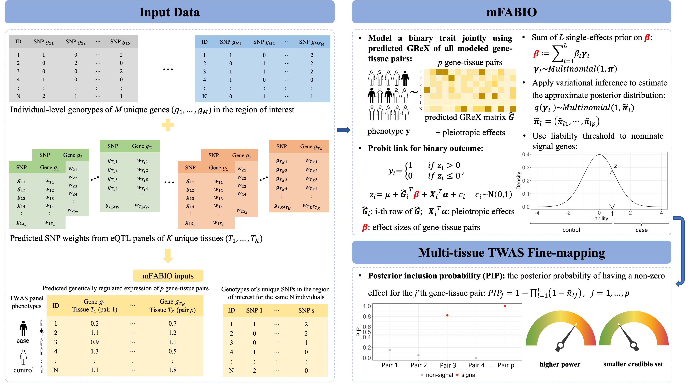

# mFABIO

## multi-tissue Fine-mApping of causal genes for BInary Outcomes (mFABIO)

FABIO is a TWAS fine-mapping method that relies on a probit model to directly relate multiple genetically regulated gene expression (GReX) to binary outcome in TWAS fine-mapping. Additionally, it jointly models all genes located on the same chromosome to account for the correlation among GReX arising from cis-SNP LD and expression correlation across genomic regions. Through a Markov chain Monte Carlo (MCMC) algorithm, it obtains the posterior probability of having a non-zero effect for each gene, which is also known as the posterior inclusion probability (PIP). PIP serves as an important measure of evidence for the gene’s association with the outcome trait, and FABIO nominates signal genes based PIP.

## How to use mFABIO

See [Tutorial](https://superggbond.github.io/mFABIO/) for detailed documentation and examples.

## Issues

For any questions or feedbacks on mFABIO software, please email to Haihan Zhang (hhzhang@umich.edu).

## Citation

Haihan Zhang, Kevin He, Lam C. Tsoi, and Xiang Zhou. "mFABIO: Multi-tissue TWAS fine-mapping to prioritize causal genes and tissues for binary traits."

