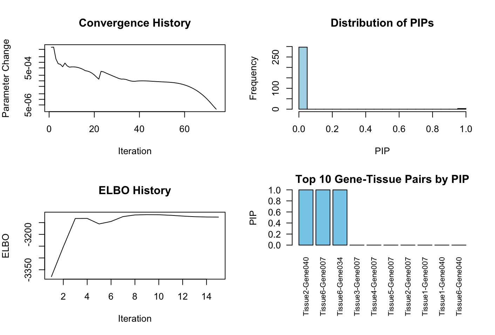

This page provides a tutorial for multi-tissue TWAS fine-mapping using mFABIO. Before runing the example code, make sure that the mFABIO software is installed successfully. For instructions on installation, please see the [Installation section](https://superggbond.github.io/mFABIO/documentation/02_Installation.html).

### mFABIO
The example data for mFABIO tutorial can be accessed following this [page](https://superggbond.github.io/mFABIO/documentation/03_Data.html). Here are the details about the input data formats and how to run mFABIO. 

### 1. Format of input for mFABIO
* Predicted GReX: We require the predicted GReX of the TWAS cohort built up using standard softwares like [SuSiE](https://github.com/stephenslab/susieR). The input GReX is expected to be a R matrix, which has column names in the format of [Tissue Name]-[Gene Name/ID]. No requirement on the row names of this R matrix. An example data matrix can be found here:
```r
library(mFABIO)
data(example_data)
> dim(example_data$G)
[1] 2000  300
> example_data$G[1:5,1:5]
     Tissue1-Gene001 Tissue2-Gene001 Tissue3-Gene001 Tissue4-Gene001 Tissue5-Gene001
[1,]      -0.7550567     -1.42914073     -0.88960517     -0.11741247      -0.4213615
[2,]       0.8011494      0.32952949     -0.14682934     -0.07053631       0.1506835
[3,]       0.5685453      0.33475624      0.01785558      0.17683326       0.1383405
[4,]       0.6705940      0.99009064     -0.47588513      0.33221315       0.5847007
[5,]      -0.4316600     -0.07432518      0.62807354     -1.01307066      -0.5182504
```

* Binary phenotypes: We also require the observed binary phenotypes of the TWAS cohort. The input phenotypes are expected as a R vector, with 1 coding for case and 0 for control. The order of the individuals here should be consistent with the order of rows in the predicted GReX matrix. An example can be found here:
```r
> dim(example_data$y)
[1] 2000    1
> head(example_data$y)
     [,1]
[1,]    1
[2,]    1
[3,]    1
[4,]    0
[5,]    1
[6,]    1
```

*  Genotypes of cis-SNPs (optional): You may include the genotypes of all the cis-SNPs used in predicting GReX to account for pleiotropic effects. The input genotypes are expected as a R matrix with no requirements on the row or column names, but the row order of the individuals here should be consistent with that in the predicted GReX matrix as well as the phenotype vector. An example can be found here:
```r
> dim(example_data$X)
[1] 2000 1000
> example_data$X[1:5,1:5]
           [,1]       [,2]       [,3]        [,4]        [,5]
[1,] -1.0357630 -0.0993181 -0.8196765 -1.04250565 -0.56026171
[2,]  1.5967262  1.3356525 -0.3146939  0.81951812  0.87080511
[3,]  0.6504174 -1.2835909 -0.5329149  0.25042639 -1.81556533
[4,] -1.1285718 -0.4096962 -1.4196629  0.03090357 -0.07253444
[5,]  0.3552911 -1.0795471  0.6296525 -0.62696991  0.63727596
```

### 2. Running mFABIO
The multi-tissue TWAS fine-mapping can be performed using the following scripts with our example data:
```r
res <- run_mfabio(example_data$G, example_data$y, example_data$X)
```

### 3. mFABIO output
mFABIO will output a summary R list object. A diagnostic glance on the results can be extracted like this:
```r
> res$plot_diagnostics()
# The true signals in our simulated example data are: Gene007 in Tissue6, Gene034 in Tissue6, and Gene040 in Tissue2.
```


The gene level PIPs can be extracted like this:
```r
> sort(res$pip_gene, decreasing = T)[1:10]
   Gene007    Gene040    Gene034    Gene030    Gene031    Gene037    Gene006    Gene048    Gene027    Gene024 
0.09971505 0.08332993 0.03362165 0.01666667 0.01666667 0.01666667 0.01666667 0.01666667 0.01666667 0.01666667 
```

The gene-tissue pair level PIPs can be extracted like this:
```r
> sort(res$pip_pair, decreasing = T)[1:10]
Tissue2-Gene040 Tissue6-Gene007 Tissue6-Gene034 Tissue3-Gene007 Tissue4-Gene007 Tissue5-Gene007 Tissue2-Gene007 Tissue1-Gene007 
   1.000000e+00    1.000000e+00    9.997819e-01    3.773916e-06    3.644649e-06    3.368552e-06    2.767472e-06    2.493055e-06 
Tissue1-Gene040 Tissue6-Gene040 
   8.795886e-08    8.508355e-08 
```

