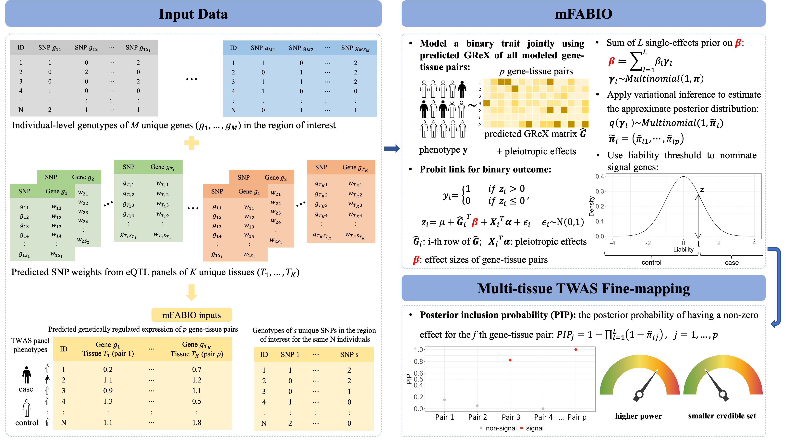

## mFABIO

mFABIO is a TWAS fine-mapping method that utilizes a probit model to directly analyze binary outcomes and jointly models gene-tissue pairs across multiple tissues within a given locus. This approach accounts for correlations in genetically regulated expression (GReX) among genes and tissues. Through a Bayesian variational inference algorithm, it obtains the posterior probability of having a non-zero effect for each gene-tissue pair, which is also known as the posterior inclusion probability (PIP). PIP serves as an important measure of evidence for the gene’s association with the outcome trait, and mFABIO generates PIPs at both the gene-tissue pair level and the gene level to nominate signal gene-tissue pairs and genes. mFABIO is implemented as a R package freely available at [https://github.com/superggbond/mFABIO/](https://github.com/superggbond/mFABIO/).

### Example Analysis with mFABIO: [here](https://superggbond.github.io/mFABIO/documentation/04_mFABIO_Example.html).
